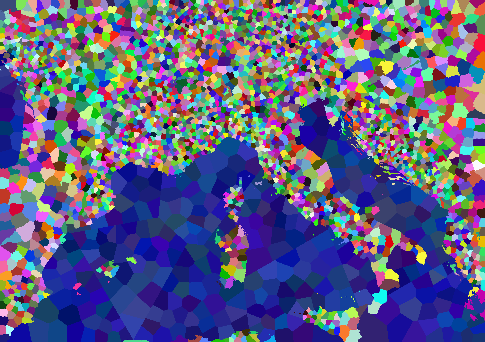

# Open Grand Strategy - Map Tool 
The OpenGS Map Tool is a specialized utility designed to streamline the creation of map data for use in grand strategy games. 
Province and territory maps form the backbone of these games, defining the geographical regions that players interact with.

## Features
- Generate and Export province maps
- Generate and Export province data
- Generate and Export territory maps
- Generate and Export territory data
- Density image support for controlling province/territory distribution
- Lake support — lakes are automatically detected and become individual provinces
- Exclude ocean from density influence per generation step
- Jagged borders — optional natural-looking borders for land and ocean regions
- Terrain system — import a terrain image to assign terrain types to provinces

## Showcase
Output territory Map:

Output Province Map:

## How to install
### Option 1 (Windows only):
1. "Releases" section in Github
2. Download and unpack "ogs_maptool.zip"
3. Run the Executable

### Option 2:
1. Clone the repository
2. Download the necessary libraries by running "pip install -r requirements.txt" in your terminal, 
inside the project directory
3. Start project by running "python main.py"

## How to use the tool
### Land Image
The first tab takes an image that specifies the ocean and lake areas of the map.
- **Ocean** must be RGB color (5, 20, 18)
- **Lakes** must be RGB color (0, 255, 0)
- Everything else is considered land

See examples in the folder "opengs_maptool/examples/input".

### Boundary Image
The second tab defines the bounds that the provinces and territories need to adhere to.
Typical use would be borders for countries, states or other administrative units.
The boundary borders must be pure black, RGB (0, 0, 0), everything else will be ignored.

### Density Image
The third tab allows you to import a density image that controls how provinces and territories are distributed.
Darker areas attract more seeds, resulting in smaller and denser regions. A normalize preset and an equator distribution preset are available.

The "Exclude Ocean" checkboxes on this tab let you ignore the density image for ocean regions during territory and/or province generation.

### Terrain Image
The fourth tab allows you to import a terrain image that assigns terrain types to provinces after generation.
Each pixel color maps to a specific terrain type. The terrain is sampled at each province's center point and constrained by province type (land provinces only receive land terrains, ocean provinces only receive naval terrains, etc.).

**Land terrains** and their RGB colors:
| Terrain  | RGB |
|----------|-----|
| forest   | (89, 199, 85) |
| hills    | (248, 255, 153) |
| mountain | (157, 192, 208) |
| plains   | (255, 129, 66) |
| urban    | (120, 120, 120) |
| jungle   | (127, 191, 0) |
| marsh    | (76, 96, 35) |
| desert   | (255, 127, 0) |

**Naval terrains:**
| Terrain     | RGB |
|-------------|-----|
| deep_ocean  | (2, 38, 150) |
| shallow_sea | (56, 118, 217) |
| fjords      | (75, 162, 198) |

**Lake terrain:**
| Terrain | RGB |
|---------|-----|
| lakes   | (58, 91, 255) |

If no terrain image is provided, defaults are used: plains for land, deep_ocean for ocean, and lakes for lake provinces.

### Territory Image
The fifth tab generates the territory map, based on the input in tab 1 and 2.
NB! You dont need both inputs, but you need at least one.
Ex. A map without any ocean does not need to have input in tab 1, but then there must be input in tab 2, and vice versa.
Both input images must have the same dimensions/size for a good result.

Use the sliders to adjust the number of territories on land and ocean.
The density strength slider controls how strongly the density image influences seed placement.

Check "Jagged Land Borders" or "Jagged Ocean Borders" to produce natural-looking, irregular borders instead of straight Voronoi edges.

Territory map and the file containing territory information (id, rgb, type, coordinates) can be exported after generation.

### Province Image
The sixth tab generates the province map, based on the generated territories.
NB! You need to generate territories before you can generate provinces.

Use the sliders to adjust the number of provinces on land and ocean.
Lakes are automatically detected and each connected lake region becomes its own province, assigned to the overlapping territory.

Check "Jagged Land Borders" or "Jagged Ocean Borders" to produce natural-looking, irregular borders instead of straight Voronoi edges.

Province map and the file containing province information (id, rgb, type, coordinates, terrain) can be exported after generation. The terrain field is included when a terrain image has been imported.
Territory history files (defining the belonging provinces per territory) can be exported after generation.

## Contributions
Contributions can come in many forms and all are appreciated:
- Feedback
- Code improvements
- Added functionality

## Discord 
Follow and/or support the project on [OpenGS Discord Server](https://discord.gg/6pRc9f6g6S)

## Delivered and maintained by 

